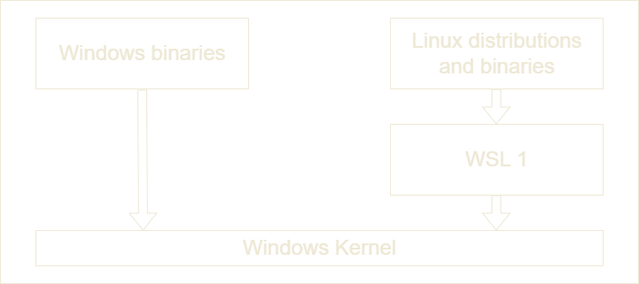

# A deep dive into Windows Subsystem for Linux

---

## Andrew Pruski

### Field Solutions Architect
### Microsoft Data Platform MVP

<!-- .slide: style="text-align: left;"> -->
<i class="fab fa-twitter"></i><a href="https://twitter.com/dbafromthecold">  @dbafromthecold</a> 
<i class="fas fa-envelope"></i>  dbafromthecold@gmail.com 
<i class="fab fa-wordpress"></i>  www.dbafromthecold.com 
<i class="fab fa-github"></i><a href="https://github.com/dbafromthecold">  github.com/dbafromthecold</a>

---

## Session Aim
<!-- .slide: style="text-align: left;"> -->
To dive into Windows Subsystem for Linux

---

  

---

## Why WSL?
<!-- .slide: style="text-align: left;"> -->
- Take advantage of linux commands on Windows 
- Run linux applications on Windows 
- Build your own custom distros 
- Lighter than running a Linux VM locally 
- Install SQL Server on Linux 
- Docker Desktop back-end

---

## History of WSL
<!-- .slide: style="text-align: left;"> -->

  

---

## History of WSL
<!-- .slide: style="text-align: left;"> -->

  

---

## History of WSL
<!-- .slide: style="text-align: left;"> -->
- August 2016 - WSL Beta - Bash on Ubuntu on Windows
- October 2017 - WSL no longer beta
  + Multiple distros available
- May 2019 - WSL 2 announced
  + Shipped with Windows 10 version 2004
- April 2021 - Ability to run Linux GUI apps announced
- October 2021 - Windows store version released
- November 2022 - version 1.0.0 released
  + Support for Windows 10

---

## WSL v1 vs WSL v2
<!-- .slide: style="text-align: left;"> -->

  

<a href="https://learn.microsoft.com/en-us/windows/wsl/compare-versions">https://learn.microsoft.com/en-us/windows/wsl/compare-versions</a>

---

## WSL v1 architecture
<!-- .slide: style="text-align: left;"> -->

  

---

## WSL v2 architecture
<!-- .slide: style="text-align: left;"> -->

  

---

## WSL Pre-requisites
<!-- .slide: style="text-align: left;"> -->
Windows 10 version 2004 and higher (Build 19041 and higher) or Windows 11  
 
Earlier versions: -  
<a href="https://learn.microsoft.com/en-us/windows/wsl/install-manual">https://learn.microsoft.com/en-us/windows/wsl/install-manual</a>

---

## Installing WSL
<!-- .slide: style="text-align: left;"> -->
<pre><code>wsl --list --online</pre></code>

  

<pre><code>wsl --install -d Ubuntu-22.04</pre></code>

---

## Running WSL
<!-- .slide: style="text-align: left;"> -->
List available local distros: -

<pre><code>wsl --list --verbose</pre></code>

Convert distro to WSL 2: -

<pre><code>wsl --set-version Ubuntu-20.04 2</pre></code>

Jump into a distro: -

<pre><code>wsl -d Ubuntu-22.04</pre></code>

---

## Configuring WSL
<!-- .slide: style="text-align: left;"> -->

* .wslconfig
  + system wide configuration
  + located in user home directory on host
- wsl.conf
  + per-distro configuration
  + located in /etc/ directory in distros

---

## Example .wslconfig
<!-- .slide: style="text-align: left;"> -->
<pre><code>[wsl2]
memory=4GB
processors=2
swap=6GB
swapfile=C:\\Temp\\wslswap.vhdx</pre><code>

---

## Example wsl.conf
<!-- .slide: style="text-align: left;"> -->
<pre><code>[boot]
systemd=true #enable systemd

[automount]
enabled=true #control host drive mounting (/mnt/c)
mountFsTab=true #process /etc/fstab for more mounts
root=/mnt/ #where drives are mounted

[interop]
enabled=true #WSL can launch windows processes
appendWindowsPath=true #add windows $PATH to WSL $PATH</pre><code>

---

## Accessing WSL filesystem
<!-- .slide: style="text-align: left;"> -->

  

---

# Demo
<!-- .slide: style="text-align: left;"> -->

---

## Converting a Docker Image to WSL
<!-- .slide: style="text-align: left;"> -->
<pre><code data-line-numbers="1|3|5|7|9|11">FROM ubuntu:20.04
 
RUN apt-get update && apt-get install -y wget software-properties-common apt-transport-https
 
RUN wget -qO- https://packages.microsoft.com/keys/microsoft.asc | apt-key add -
 
RUN add-apt-repository "$(wget -qO- https://packages.microsoft.com/config/ubuntu/20.04/mssql-server-2019.list)"
 
RUN apt-get update &amp;&amp; apt-get install -y mssql-server
 
CMD /opt/mssql/bin/sqlservr</pre></code>

---

## Converting a Docker Image to WSL
<!-- .slide: style="text-align: left;"> -->
<pre><code data-line-numbers="1|3|4|5-6|7|8">docker build -t sqlserver2019 .

docker container run -d `
--publish 1433:1433 `
--env ACCEPT_EULA=Y `
--env MSSQL_SA_PASSWORD=Testing1122 `
--name sqlcontainer1 `
sqlserver2019</pre></code>

---

## Converting a Docker Image to WSL
<!-- .slide: style="text-align: left;"> -->
<pre><code data-line-numbers="1|3|5">docker stop sqlcontainer1

docker export sqlcontainer1 -o C:\temp\sqlcontainer1.tar

wsl --import sqlserver2019 C:\wsl-distros\sqlserver2019 C:\temp\sqlcontainer1.tar --version 2</pre></code>

---

## Converting a Docker Image to WSL
<!-- .slide: style="text-align: left;"> -->

<pre><code>wsl --list --verbose</pre></code>

  

---

## Converting a Docker Image to WSL
<!-- .slide: style="text-align: left;"> -->

<pre><code>wsl -d sqlserver2019 bash -c "setsid /opt/mssql/bin/sqlservr"

wsl --list --verbose</pre></code>

  

---

## Converting a Docker Image to WSL
<!-- .slide: style="text-align: left;"> -->

<pre><code>wsl -d sqlserver2019 ps aux</pre></code>

  

---

## Converting a Docker Image to WSL
<!-- .slide: style="text-align: left;"> -->

<pre><code data-line-numbers="1|3">wsl -t sqlserver2019

wsl --unregister sqlserver2019</pre></code>

  

---

# Demo

---

# Running SQL Server in WSL
<!-- .slide: style="text-align: left;"> -->

---

  

---

## Running SQL Server in WSL
<!-- .slide: style="text-align: left;"> -->

  

<a href="https://devblogs.microsoft.com/commandline/systemd-support-is-now-available-in-wsl/">https://devblogs.microsoft.com/commandline/systemd-support-is-now-available-in-wsl/</a>

---

## Running SQL Server in WSL
<!-- .slide: style="text-align: left;"> -->

Create <i>/etc/wsl.conf</i> and add: -
<pre><code>[boot]
systemd=true</pre></code>

Restart WSL: -
<pre><code>wsl --shutdown</pre></code>

---

## Running SQL Server in WSL
<!-- .slide: style="text-align: left;"> -->

Confirm: -
<pre><code>systemctl list-unit-files --type=service</pre></code>

  

---

## Running SQL Server in WSL
<!-- .slide: style="text-align: left;"> -->

<pre><code data-line-numbers="1|3|5|7|9|11">sudo apt update && sudo apt upgrade
	
wget -qO- https://packages.microsoft.com/keys/microsoft.asc | sudo apt-key add -

sudo add-apt-repository "$(wget -qO- https://packages.microsoft.com/config/ubuntu/20.04/mssql-server-2022.list)"

sudo apt-get update

sudo apt-get install -y mssql-server

sudo /opt/mssql/bin/mssql-conf setup</pre></code>

---

  

---

## Running SQL Server in WSL
<!-- .slide: style="text-align: left;"> -->

<pre><code>systemctl status mssql-server</pre></code>

  

---

# Demo

---

## Resources
<!-- .slide: style="text-align: left;"> -->

<a href="https://github.com/dbafromthecold/wsldeepdive">https://github.com/dbafromthecold/wsldeepdive</a> 
<a href="https://dbafromthecold.com/2022/09/27/running-sql-server-in-windows-subsystem-for-linux-wsl/">https://dbafromthecold.com/2022/09/27/running-sql-server-in-windows-subsystem-for-linux-wsl/</a> 
<a href="https://dbafromthecold.com/2021/04/13/converting-a-sql-server-docker-image-to-a-wsl2-distribution/">https://dbafromthecold.com/2021/04/13/converting-a-sql-server-docker-image-to-a-wsl2-distribution/</a>

 

  

